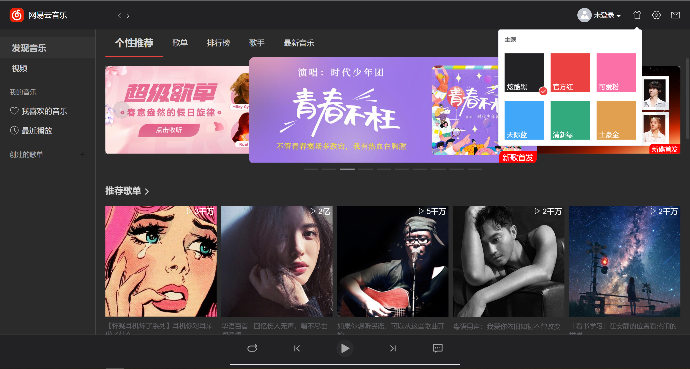
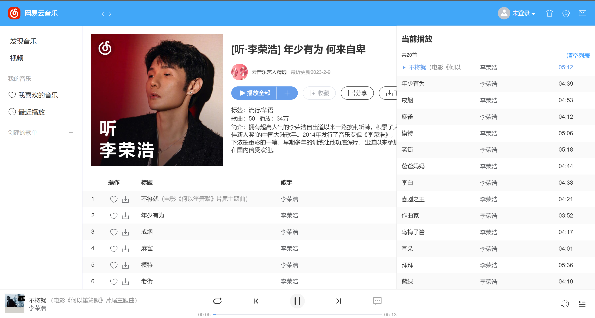
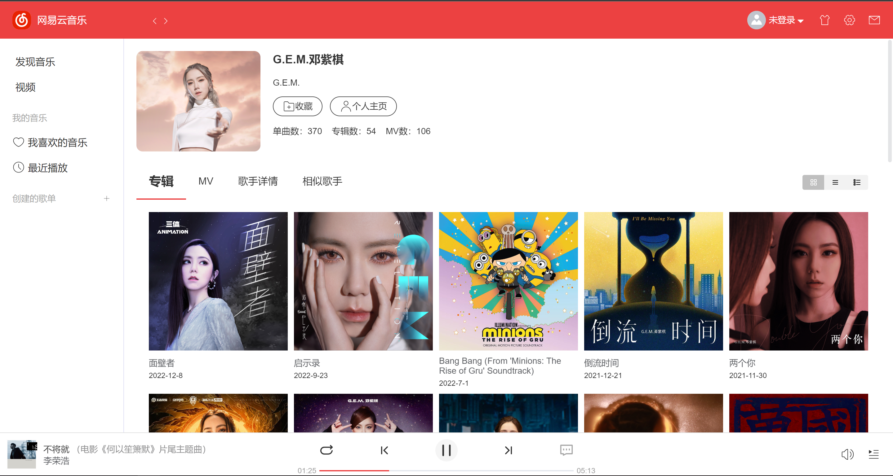

# Vue3-Music

基于 Vue3+TypeScript 开发的web端音乐播放器，界面参照网易云音乐桌面客户端。实现了暗黑主题等多主题切换。

在线体验：https://leoj340.github.io/vue3-music/

## 本地安装
```
git clone https://github.com/leoj340/vue3-music.git
cd vue3-music
pnpm install
pnpm run dev
```

## 网易云音乐API
后端API使用[网易云音乐 Node.js API service](https://github.com/Binaryify/NeteaseCloudMusicApi)

在线体验已将后端部署，如果你想自己搭建api服务，可参考[开发文档](https://binaryify.github.io/NeteaseCloudMusicApi)

## 预览







